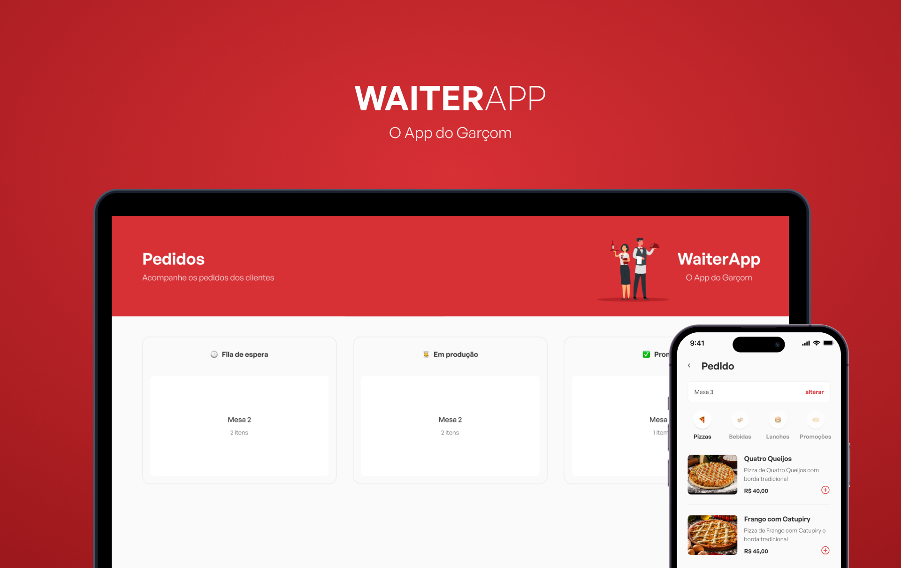
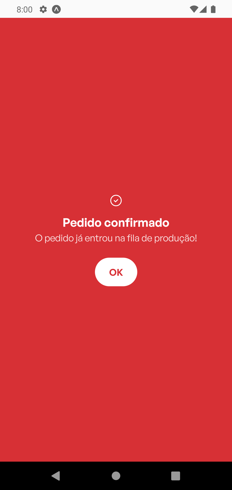

# Waiter App

 <br/> <br/>

## Funcionalidades da aplicação
# Web
- Monitorar pedidos em tempo real
- Alterar estado de produção de pedidos
- Remover pedidos

# Mobile
- Inspecionar produtos
- Adicionar/remover produtos no carrinho
- Realizar pedidos

## Tecnologias utilizadas
# Web
- React
- TypeScript
- Styled Components
- Axios
- Vite

# Mobile
- React
- TypeScript
- Expo
- Styled Components
- Axios

# API
- TypeScript
- Node
- Express
- MongoDB
- Mongoose

## Web


## Mobile
<p align="center">





### Instalação
1. Clone o repositório:

```bash
git clone https://github.com/jlefilho/waiter-app.git
```

2. Acesse a pasta da API do projeto:

```bash
cd api
```

3. Instale as dependências necessárias:

```bash
npm install
```

4. "Suba" o server:

```bash
npm run dev
```

5. Acesse a pasta Web do projeto:

```bash
cd ..
cd web
```

6. Instale as dependências necessárias:

```bash
npm install
```

7. Execute a aplicação Web:

```bash
npm run dev
```

8. Acesse a pasta Mobile do projeto:

```bash
cd ..
cd mobile
```

9. Instale as dependências necessárias:

```bash
npm install
```

10. Execute a aplicação Mobile:
```bash
npx expo start
```

11. Inserir o IP da sua máquina no arquivo api.ts na pasta utils.
